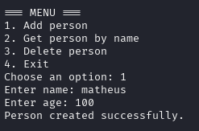

# Unix Socket REST

A small Rust project that sets up a simple client-server communication using Unix Domain Sockets (UDS). It lets you send and receive data about people (like name and age) using a lightweight, REST-like message format.

## Screenshot

## Features

- In-memory data storage for Person entries (name & age)
- Request types: GET, POST, DELETE
- MessagePack-based serialization via rmp-serde
- Simple CLI interface on the client

## Usage

###  Start server:
    cargo run --bin server
    
### Start client:
    cargo run --bin client

## 📝 License

This project is open-source under the MIT License.
